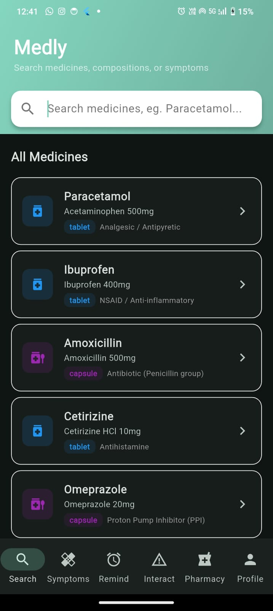
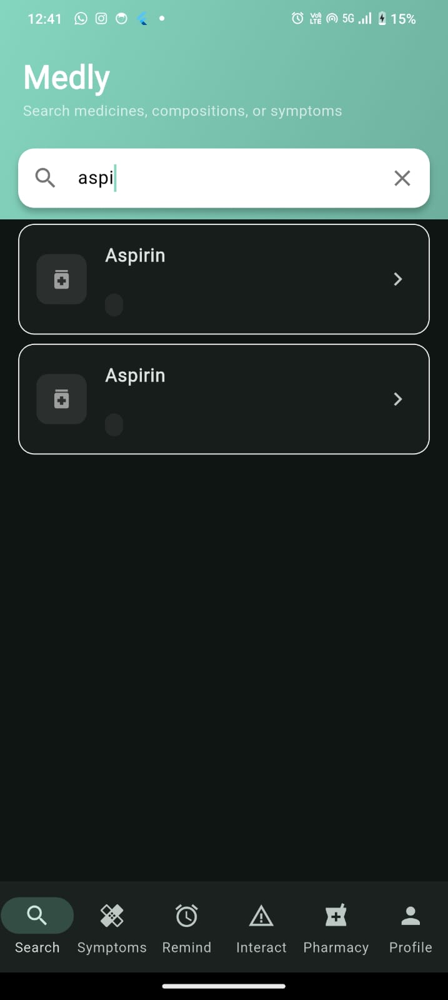
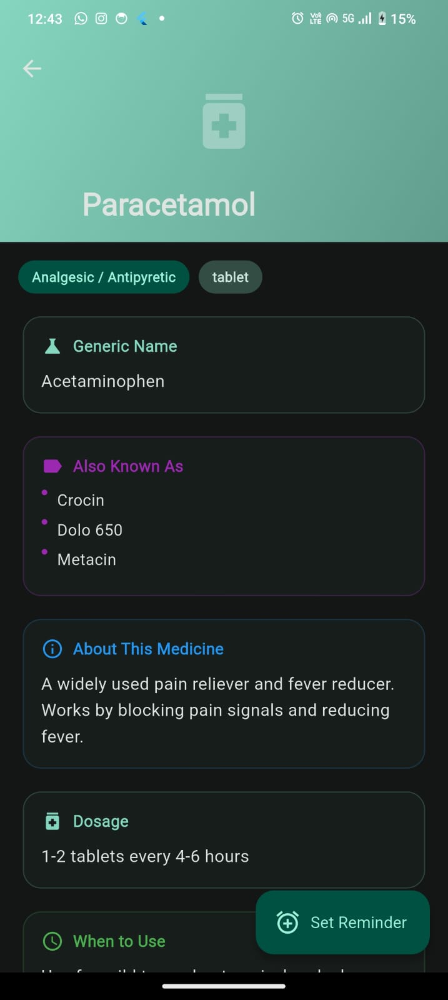
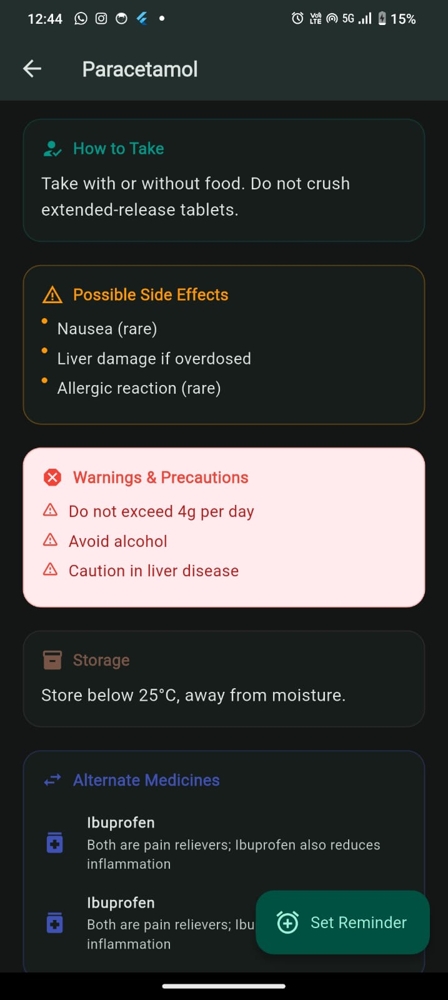
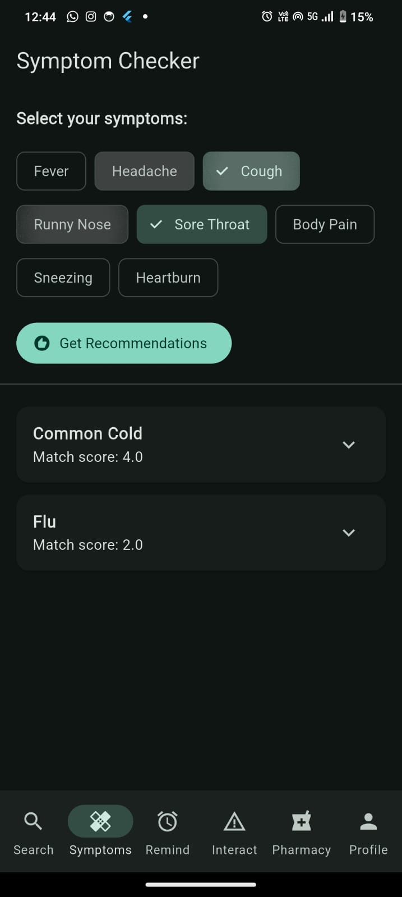
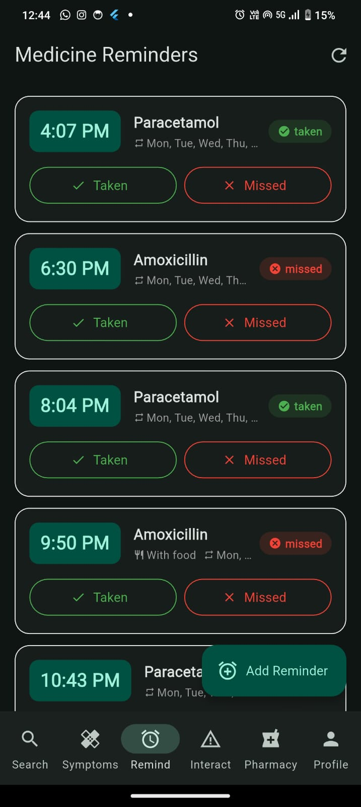
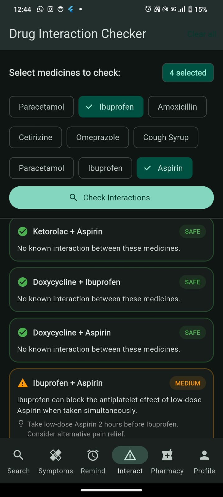
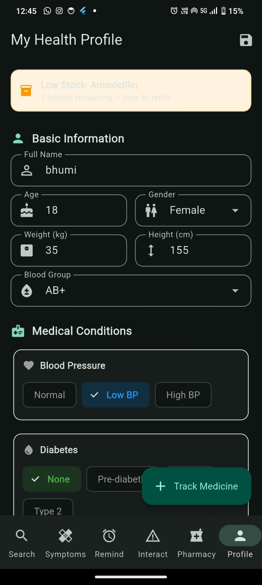
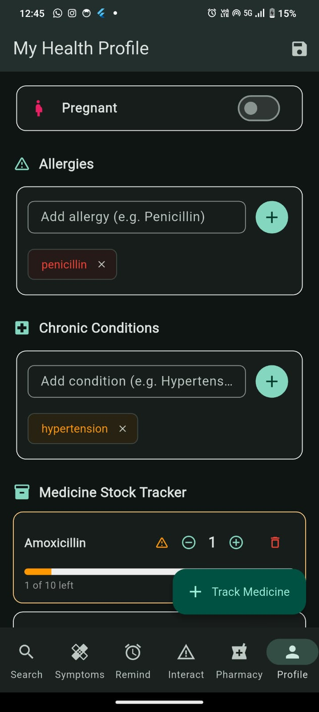
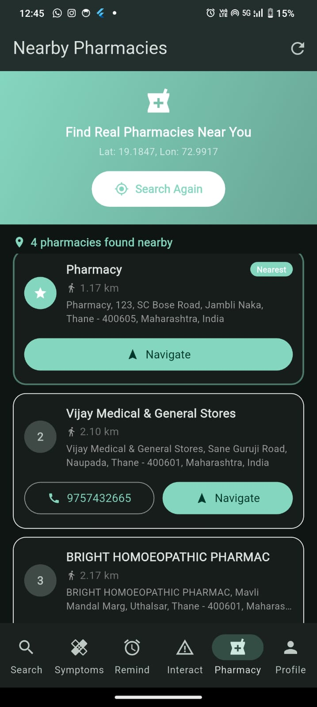

# medly

A new Flutter project.

# Getting Started

This project is a starting point for a Flutter application.

A few resources to get you started if this is your first Flutter project:

- [Lab: Write your first Flutter app](https://docs.flutter.dev/get-started/codelab)
- [Cookbook: Useful Flutter samples](https://docs.flutter.dev/cookbook)

For help getting started with Flutter development, view the
[online documentation](https://docs.flutter.dev/), which offers tutorials,
samples, guidance on mobile development, and a full API reference.

# App Description

**Medly** is a smart, comprehensive pharmacy and medicine assistant application designed to streamline medication management and improve user adherence. It empowers users with a seamless platform to discover medicines, verify safe drug combinations, schedule personalized medication reminders, and locate nearby pharmacies. With advanced features like symptom-based recommendations and intelligent data fetching, Medly acts as a robust, all-in-one healthcare companion for both mobile and web platforms.

---

# Features

1. Smart Medicine Search & Discovery
   * Fast, intuitive search for medicines and drugs.
   * Automated Data Fetching: Integration with the OpenFDA API to automatically source, fetch, and persist missing drug data in the background, ensuring a vast and up-to-date medicine library.

2. Drug Interaction Checker
   * Built-in safety mechanisms to check potential interactions between multiple medications before consumption, helping to prevent adverse effects.

3. Medication Scheduling & Reminders
   * Create personalized schedules for daily medicine intake.
   * Timely local push notifications to remind users when it's time to take their pills, improving medical adherence.
   * Low-stock alerts to remind users to refill their prescriptions.

4. Symptom-based Recommendations
   * An intelligent recommendation engine that suggests appropriate over-the-counter medicines and remedies based on user-inputted symptoms.

5. Pharmacy Locator
   * Uses real-time location services to help users discover nearby pharmacies and provides direct navigation assistance.

6. Cloud Sync & User Profiles
   * Secure, cloud-synced user profiles using a remote database, ensuring that users can access their medical history and reminders across multiple devices.

7. Offline Support
   * Local database caching ensures that users can access their essential medication details even without an active internet connection.

# Tech Stack

1. Frontend (Mobile & Web)
* Framework: Flutter (Dart) - v3.10.0+
* Design System: Material Design / Cupertino Icons
* Architecture: Provider/Service-based architecture (e.g., `InteractionService`, `ReminderService`)

2. Backend & Database
* Primary Backend (Cloud): Supabase (PostgreSQL) - Used for cloud synchronization, user profiles, and remote storage.
* Local Database: SQLite (`sqflite`) - Used for offline caching and fast local data retrieval.

3. Integrations & APIs
* External Medical Data: OpenFDA API - Utilized via `medicine_fetch_service.dart`.
* HTTP Client: `http` package for RESTful requests.

4. Native Device Services
* Location Services: `geolocator` - For accessing device GPS and mapping nearby pharmacies.
* Notifications: `flutter_local_notifications` & `timezone` - For scheduling and handling reliable, localized push notifications.
* Navigation: `url_launcher` - For redirecting users to maps or external links.

## Screenshots

##  How to Run

1. Clone the repository
git clone https://github.com/masanebhumika-alt/medly_app.git

2. Go to project folder
cd medly_app

3. Install dependencies
flutter pub get

4. Run the app
flutter run
